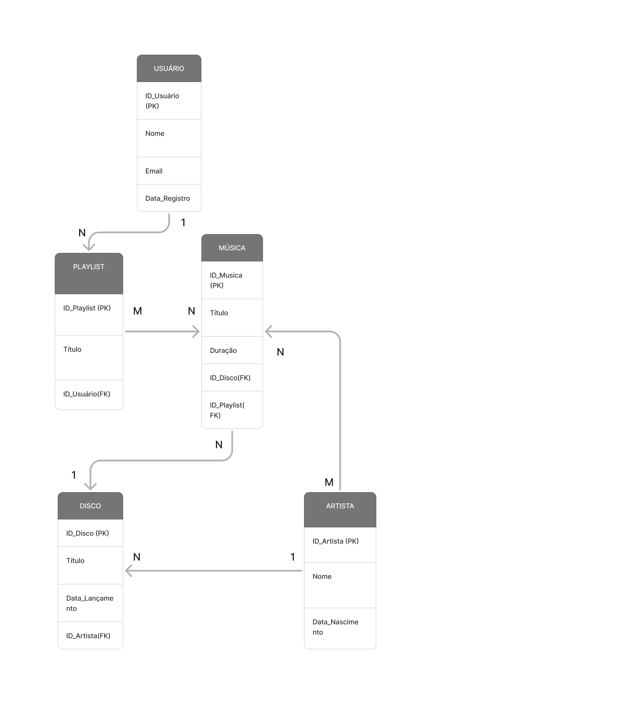

# Projeto_CC5232
Projeto da matéria Banco de Dados (CC5232)

# Integrantes 
Andre Lourenco Marques - 11.120.386-5

Henrique Barros Simões - 11.120.157-0

Leonardo Martins Qualharello - 11.120.470-7

# Modelo Entidade-Relacional

# Modelo Relacional

# Como rodar o código 

  - O arquivo query_project.sql contém todas as queries necessárias para a construção do projeto.
  - O arquivo algebra_relacional.sql contém todas as queries necessárias para tratar as questões de algebra relacional do projeto 
  - O arquivo random_values.py contém o código para a geração e inserção de dados aleatórios.

    1° Importe os arquivos "query_project.sql" e "algebra_relacional.sql" dentro do seu banco, execute os comandos:
       - CREATE DATABASE  IF NOT EXISTS `project_spotify` /*!40100 DEFAULT CHARACTER SET utf8mb4 COLLATE utf8mb4_0900_ai_ci */ /*!80016 DEFAULT ENCRYPTION='N' */;
       - USE `project_spotify`;''
       - Esses códigos estão no arquivo "query_project.sql", e são responsáveis para criar um novo database.

    2° Para a inserção dos dados aleatórios:
      - Importe o arquivo random_values.py no seu software interpretador de python 
      - Para a conexão pyhton e mysql: execute o seguinte código no terminal do windows -> pip install mysql-connector-python Faker
      - Execute o arquivo random_values.py

    3° Volte para o banco de dados e execute as queries do arquivo "algebra_relacional.sql"
  

