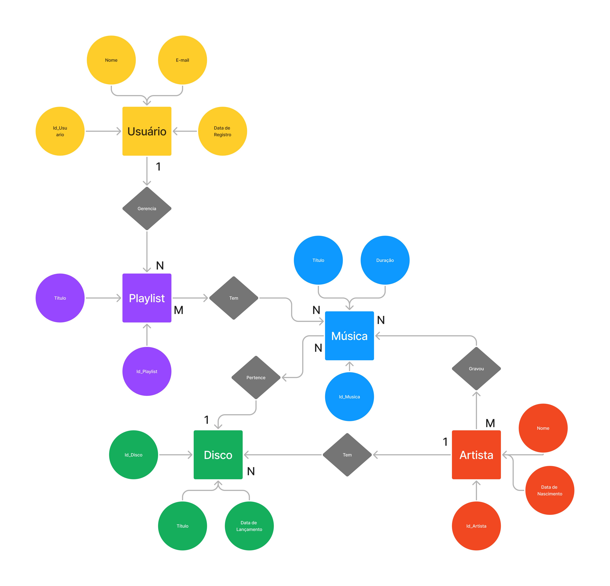

# Projeto_CC5232
Projeto da matéria Banco de Dados (CC5232)

# Integrantes 
Andre Lourenco Marques - 11.120.386-5

Henrique Barros Simões - 11.120.157-0

Leonardo Martins Qualharello - 11.120.470-7

# Modelo Entidade-Relacional

# Modelo Relacional

# Como rodar o código 

  - O arquivo query_project.sql contém todas as queries necessárias para a construção do projeto.
  - O arquivo algebra_relacional.sql contém todas as queries necessárias para tratar as questões de algebra relacional do projeto 
  - O arquivo conecta.py contém o código para a geração de dados aleatórios.

    1° Importe os arquivos "query_project.sql" e "algebra_relacional.sql" dentro do seu banco, execute os comandos:
       - CREATE DATABASE  IF NOT EXISTS `project_spotify`;
       - USE `project_spotify`;
       - Esses códigos estão no arquivo "query_project.sql", e são responsáveis para criar um novo database.

    2° Para a inserção dos dados aleatórios:
      - Execute o seguinte código no terminal do windows: pip install faker
      - Importe o arquivo conecta.py no seu software interpretador de python 
      - Execute o arquivo conecta.py
      - Irá gerar um arquivo chamado seeder.sql no próprio vscode
      - Importe o arquivo seeder.sql no banco de dados e execute as queries de inserção

    3° Volte para o banco de dados e execute as queries do arquivo "algebra_relacional.sql"
  

